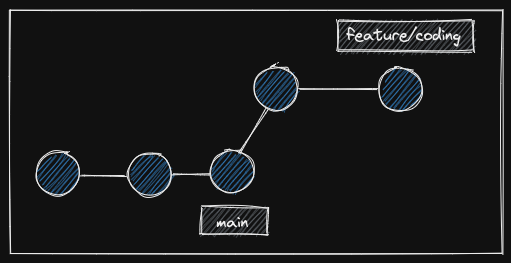
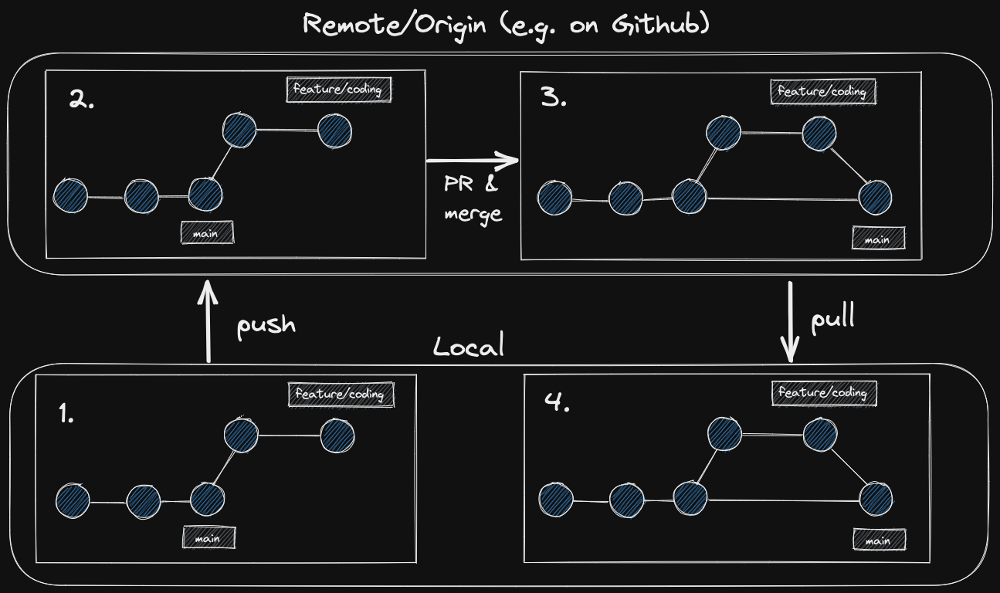

# morning notes for git branches

## process from yesterday

    1. git init
    2. git remote add
    3. git add .
    4. git commit -m "comment"
    5. git push origin main

## process of adding branches and working in them and then merging

<>

### Process

    only if necessary, eg a new project
    # dont create a new repo for a new branch - doesnt make sense!

    1.create local repo
    2. create remote repo

    1. create a new feature branch and work on that new branch.

                command                                       functionality
        'git switch -c "name of new branch"'               create a new branch and switch to it

    do your work on the new branch - the main branch is not effected.

    2. Commit the changes of the new branch (keeping track!!)
        1. 'git remote add'
        2. 'git add .'
        3. 'git commit -m "comment"'
       -> *DO NOT PUSH!!*
       -> finish work and do lots of commits for each step!!!

    3. Then PUSH the changes from the new branch local to new branch remote
        1. last commit see above
        2. be in repository-folder git:(newbranchname) !!
        3. 'git push -u origin "new branchname" '
                -> Pushes the changes and the new branch
                -> first time use '-u' in the commandd
                -> after you have done this once, you can use 'git push origin "new branch name" for this branch!!

    ##### IF ERROR:

        ➜  session-notebook git:(notes/github-and-markdown) git push -u notes/github-and-markdown
                fatal: 'notes/github-and-markdown' does not appear to be a git repository
                fatal: Could not read from remote repository.
                Please make sure you have the correct access rights and the repository exists.
        DO THIS:
        1. open github website
        2. open repository in this case session-notebook
        3. copy SSH Code from green button "code"
        4. then go back to terminal:
        5. enter 'git remote add origin'
        6. paste link "git@github.com:charis-amend/session-notebook.git"

    4. Create a pull request on GitHub website from the new branch into main
        1. multiple steps on the *github website* like button pull
        2. creates link
        3. *share pull request link in slack* #pull-request
        4. Review the pull request
        (5. implement changes if needed)
        (6. push again - see step 3. above to update the pull request until it gets approved)

    5. Merge the pull request into main on GITHUB WEBSITE!!!
        merge your feature branch into the main branch, so all your work is included in the main branch!

    6. Then PULL from local laptop
        so you get the merge on the github website on your laptop

        # DONT USE git merge!!

        -> DONT FORGET !!!!! 1. 'git switch main' to MAIN branch
        2. then 'git pull origin main' the main branch from the github website

    7. Delete the new branch on GitHub and delete locally
        # ON GITHUB WEBSITE
        delete button for the new branch

        # LOCAL on LAPTOP
        1. be in git:(main) not in the git:(newbranch)
        2. type 'git branch -d "branchname" '
