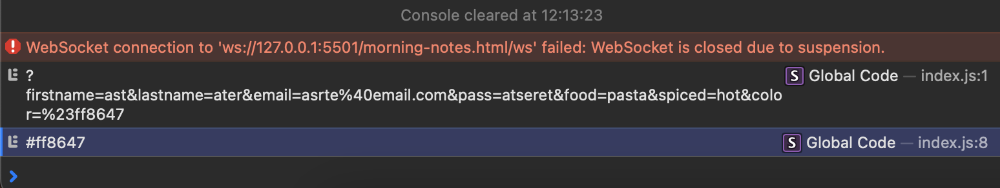

## how url is being upated with submit button

if i entered values inside the boxes it shows the
entered content in the url
the name is gonna name the input. this is important to get the value from the input later
-> if i dont put anything in name="" then it wont show the entered value in the url
-> see screenshot, it only shows the lastname

## final result of form example

# with JS

1. looking for an object on webpage
2. creating a variable like params
   const params = new URLSearchParams(window.location.search);
3. this print gets the value of URLSearchPARAMS
   console.log(params.get("color"));
4. then test
   console.log(document.body);

