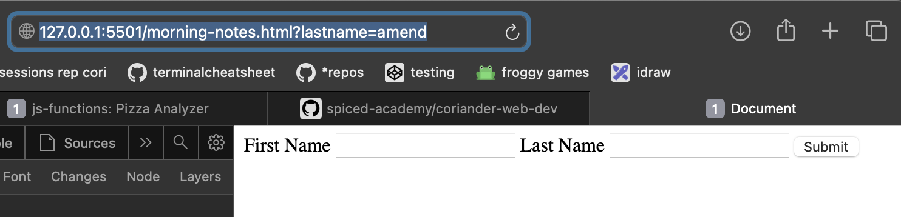
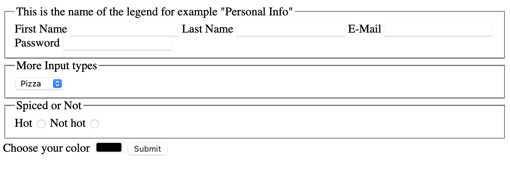

if i entered values inside the boxes it shows the
entered content in the url
the name is gonna name the input. this is important to get the value from the input later
-> if i dont put anything in name="" then it wont show the entered value in the url
-> see screenshot, it only shows the lastname

final result

