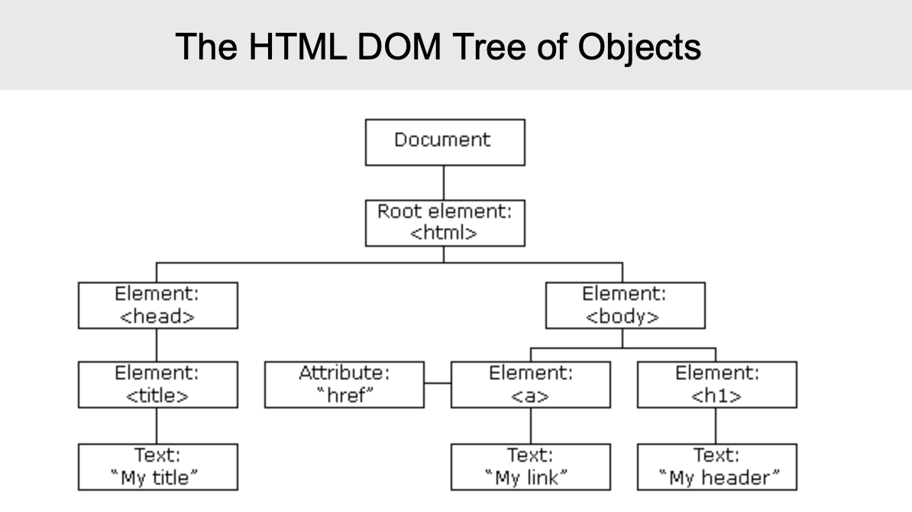
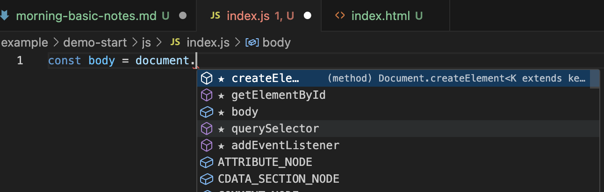

# javascript BASICS

## The HTML DOM (Document Object Model)

- instead of hardcoding the html we can manipulate our html
  - ask
    - what do we have in our html file
    - add js file in the end or use the "defer" option in the <script> tag

When a web page is loaded, the browser creates a Document Object Model of the page.

The HTML DOM model is constructed as a tree of Objects:



### with DOM JavaScript gets all the power it needs to create dynamic HTML:

JavaScript can change all the HTML elements in the page
JavaScript can change all the HTML attributes in the page
JavaScript can change all the CSS styles in the page
JavaScript can remove existing HTML elements and attributes
JavaScript can add new HTML elements and attributes
JavaScript can react to all existing HTML events in the page
JavaScript can create new HTML events in the page

## selecting elements

- we only select 1 ITEM at a time !!!!

#### we can select by

1. classes
2. id
3. data-js

### in the example:



1. selecting element in html

```js
const body = document.querySelector('[data-js="body"]');
console.log("document:", document);
```

                                                ^^^^
                                                body = name of the selected element in html

2. then edit in hmtl:

```html
<body data-js="body"></body>
```

3. then edit in js:

if we want to add/remove classes and css style in our js file

```js
// adding classes and removing class
bodyContainer.classList.add("blue");
bodyContainer.classList.remove("blue");
```

### the hmtl connects the css, the js is connected with the hmtl

connection tree:
------------html file--------------
------/----------------- \ ------

```html
<script>tag             <link>tag
js file ---          --- css file
```

## events

if i click something its an event

with this code:

```js
myLoggingButton.addEventListener("click", (event) => {
  console.log("You clicked a button:", event);
});
```

### event types of js

#### mouse events

clicks, ...

## clear out console

```js
// to clear out console:
console.clear();
```

## toggle for add+remove button in one
