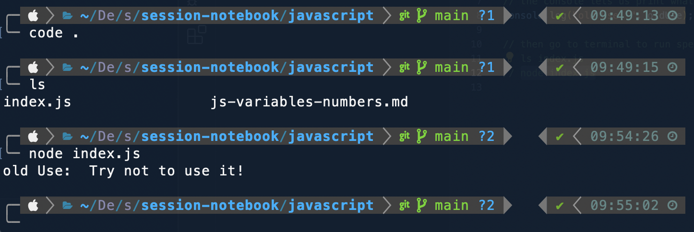
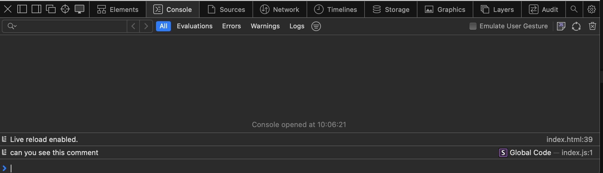
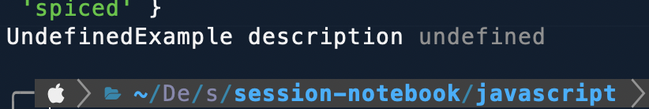
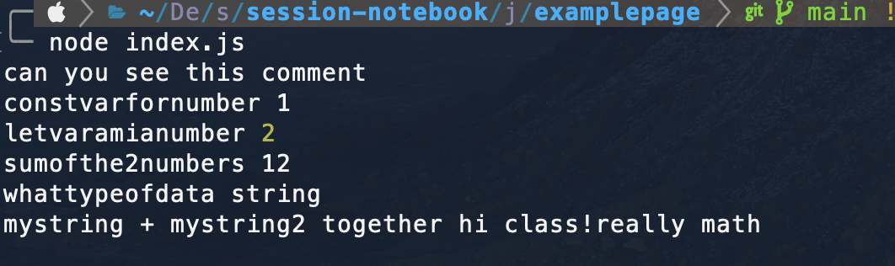

# javascript variables & numbers (morning session)

------------------------------SCREENSHOTS----------------------------------------
how terminal looks like:


how web dev tools look in safari browser:


how udnefined error looks like


how to see the data type of the variable's value:

---------------------------------SCREENSHOTS-------------------------------------

## CONTENT

## VAR vs CONST and LET

```js
// this was used before 2015
var oldUse;
oldUse = "Try not to use var, instead use const or let!";

// the console lets us print what variables we created
console.log("old Use: ", oldUse);

// Starting from 2015
// using let and const
let newVariableforLETexample = "i can change over time";

// const newVariableWillNotChange;
// const always has to be initialized because the const value will be there forever otherways error
// -> do it like this:
const newVariableWillNotChange = "You are stuck with me!";
```

#### to run JS files:

1.  use terminal:
    ls index.js
    node filename.js

2.  use vs code terminal
    go to "RUN"
    click on "run without debugging"
    select the node.js or any other file you would like to run

3.  in the browser
    -> we need an hmtl file for that (see index.html file)
    open developer tools to see the console

        1. create hmtl file
        2. <script src="./index.js" defer></script>
        3. src defined
        4. defer means hmtl file loads first and then the js file

        -> you can put the script tag in the head or in the body: <script src="./index.js" defer></script>

## CONSOLE LOG printing the results of js

```js
// console log is a way to print things in the terminal to check if everything is right
console.log("NameOfConstVariableExample", newVariableWillNotChange);
console.log("NameConstVariableExample description", newVariableWillNotChange);
```

## DATA TYPES (typeof)

```js
// Booleans:
const BooleanExample = true;
console.log("BooleanExample description", BooleanExample);

// Strings:
const StringExample = "this a string! 1234 %$&";
console.log("StringExample description", StringExample);

// Number:
const NumberExample = 385;
console.log("NumberExample description", NumberExample);

// BigInt
// BigInt sind Zahlen die so groß sind, die nicht dargestellt weerden können
// you tell the variable to reeserve more space
const BigIntExample = 300400600n;
console.log("BigIntExample description", BigIntExample);

// NULL (special)
const NullExample = null;
console.log("nullexample description", NullExample);

// Array
const ArrayExample = ["Element1", 2, "element3", false, 5];
// combining all data types in the array is possible
console.log("arrayexample description", ArrayExample);

// Object
// if we work with objects, we need a key and give each key a certain value
// key= cohortname --- value=coriander
const ObjectExample = {
  cohortName: "Coriander",
  amountStudents: 16,
  academy: "spiced",
};
console.log("ObjectExample description", ObjectExample);
```

#### Error for undefined variable

```js
// if we have a undefined variable
let UndefinedExample;
console.log("UndefinedExample description", UndefinedExample);
```

## Operators

### SUMMING

    is one ofthe variables a string then the values all as a string an dputs one string next to the other.
    if variables are both numbers it does the math

```js
let sumofnumbers = isANumber + amIaNumber;
console.log("sumofthe2numbers", sumofnumbers);
console.log("whattypeofdata", typeof sumofnumbers);
// summing 2 strings
const myString = "hi class!";
const mystring2 = "really math";
console.log("mystring + mystring2 together", myString + mystring2);
```

### CONVERTING VARIABLE TYPE

```js
// how to convert a variable's value data type for examaple from string to number
// we use parseInt
let convertedStringtoNumber = parseInt(isANumber) + amIaNumber;
console.log("converted String to aNumber:", convertedStringtoNumber);
```

### SHORTCUT ADDING TO A VARIABLES VALUE

```js
// how to add only one
console.log("onlyadding +1:");
console.log("initial amIaNumber value:", amIaNumber);
amIaNumber = amIaNumber + 1;
console.log("adding amIanumber initiaaal value +1", amIaNumber);
// this is a shortcut for the amIaNumber = amIaNumber + 1:
// you take value of the variable amIaNumber, you add 1,
// and then return the new value it immediately and reassign the new value to the variable
amIaNumber += 1;
console.log("new am i a number value which is 3 += 1:", amIaNumber);

// 4. console.log("Math.PI", Math.PI);
amIaNumber = 5;
const giveMeMore = 3;
amIaNumber += giveMeMore;
console.log("5. amianumber += givememore", amIaNumber);
```

### SUBTRACT

```js
console.log("type of isanumber", typeof isANumber);
//-> the subtract converts everything to a number
console.log("isanumber", isANumber);
console.log("amianumber", amIaNumber);
let subtractexample = amIaNumber - isANumber;
console.log("subtracting:", subtractexample);
console.log("type of the subtract example:", typeof subtractexample);
```

### OVERVIEW SUM AND SUBTRACT

    1. SUM
        one var is a string
        one var is a number
        -- sum adds the two variables together as two strings

    2. SUBTRACT
        one var is a string
        one var is a number
        -- subtract adds the two variables together as two numbers --> doing math!!

### MULTIPLYING

```js
amIaNumber = 3;
amIaNumber *= 2;
// this multiplies amIaNumber with 2 and returns the new value
console.log("amianumber multiplied by 2 aand returned", amIaNumber);
const numberString = "10";
subtractexample = isANumber - numberString;
console.log("subtraacting isanumber - numberstring", isANumber - numberString);
console.log("type of the subtractexample", typeof subtractexample);
```

### REMAINDERS

```js
// how do i know if a number is even?
// dividing the number by 2 - there should be no remainder
// remainder=2
/* Example:
    10/2=5 --- remainder=0 then even number 
    11/2=5 --- remainder=1 not a even number
*/
// symbol for remainder is %
amIaNumber = 9;
amIaNumber %= 2;
console.log("is amIaNumber an even number? this is the remainder:", amIaNumber);
amIaNumber = 10;
amIaNumber %= 2;
console.log("is amIaNumber an even number? this is the remainder:", amIaNumber);
```

### POTENTIATES

```js
// (Potenzen 3^3= 3*3*3= 27)
amIaNumber = 2;
const potentialexample = 2;
amIaNumber = amIaNumber ** potentialexample; //this would be 2^2
console.log("the potenze of amianumber:", amIaNumber);
amIaNumber = 4;
const potentialexample2 = 4;
amIaNumber = amIaNumber ** potentialexample2; //this would be 4^4 = 4*4*4*4
console.log("the potenze of amianumber:", amIaNumber);
```
