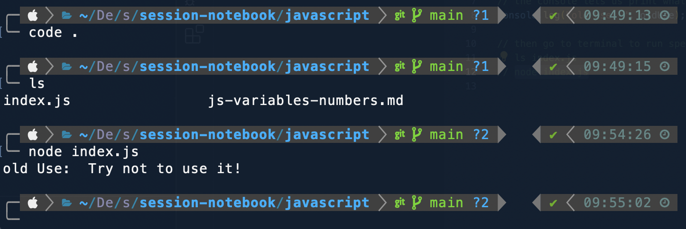
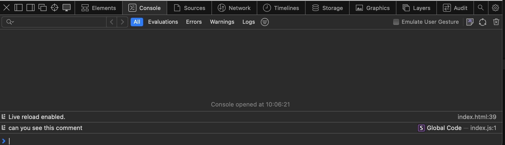
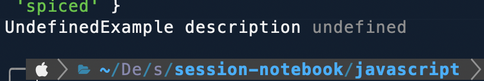
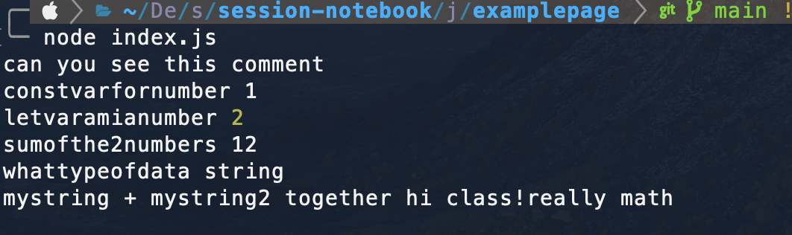

# javascript variables & numbers (morning session)

how terminal looks like:

how web dev tools look in safari browser:

how udnefined error looks like

how to see the data type of the variable's value:

