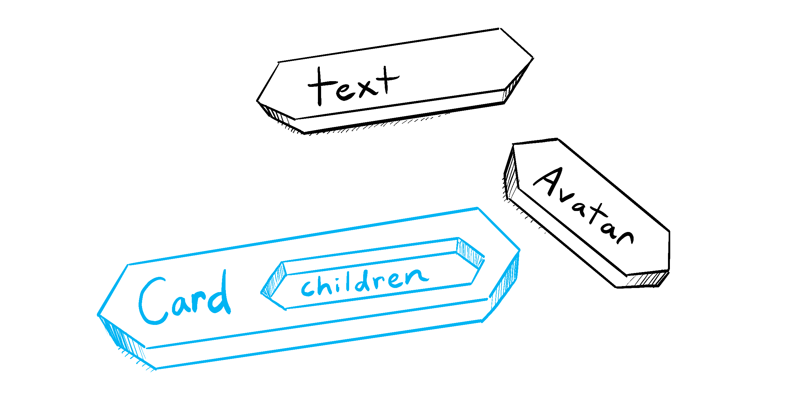

# Nesting React

## structure

### passing a jsx as a prop

- elements created by jsx are any object or any prop
- props are functions that return jsx
- jsx needs to return at least one element

- add one parent element!
- tricking js:
- `<div>` is removed and instead only `<h2>` and `<p>` are there
- not passing p tag but directly the description
- now to this description i can pass directly the jsx/html elements to my props

props are not only objects but also jsx elements,
they can be passed as well:

```
function UserCard({ avatar }) {
  return
  <div className="card">
  {avatar}
  </div>;
}
```

avatar being passed as a jsx element:
{ avatar } --> avatar={<Avatar />}

```
function App() {
    return
    <UserCard avatar={<Avatar />} />;
    }
```

## children Props

You can think of a component with a children prop as having a “hole” that can be “filled in” by its parent components with arbitrary JSX.

https://react.dev/images/docs/illustrations/i_children-prop.png

You will often use the children prop for visual wrappers: panels, grids, etc.

If you nest a component inside of another component, the nested component is passed as a prop to the parent component. This special prop is called children.

```
<UserCard>
  <Avatar />
</UserCard>
```

- UserCard is parent component
- Avatar is child prop
- always write ({children}) here:

```
function UserCard({ children }) {
  return
  <div className="card">
  {children}
  </div>;
}
```

- This component (=UserCard) will render the nested element(=children) as a child of the div element.
- 💡 The nested element(s) can be a single element, multiple elements, or even a string or number.

## Fragments

- if we want to return multiple elements from a component function BUT without wrapping them in a div or other element...
- we use
  - a Fragment <></>
  - or
  - `<Fragment></Fragment>`

### !!! React components can only return a single element from a component function !!!

#### with the `<Fragment></Fragment>`:

`<Fragment></Fragment>` syntax is only necessary if you want to pass the special key prop to the fragment, which will become important when you start working with lists, like this:

```js
<Fragment key={ {/*special key prop*/} }>...</Fragment>.
```

```js
import { Fragment } from "react";

function UserList({}) {
  return (
    <Fragment>
      {/* sometimes might see <React.Fragment></React.Fragment>, which is the same thing.*/}
      <UserCard>
        <Avatar />
      </UserCard>
      <UserCard>
        <Avatar />
      </UserCard>
    </Fragment>
  );
}
```

#### with only <></>:

```js
function UserList() {
  return (
    <>
      <UserCard>
        <Avatar />
      </UserCard>
      <UserCard>
        <Avatar />
      </UserCard>
    </>
  );
}
```
